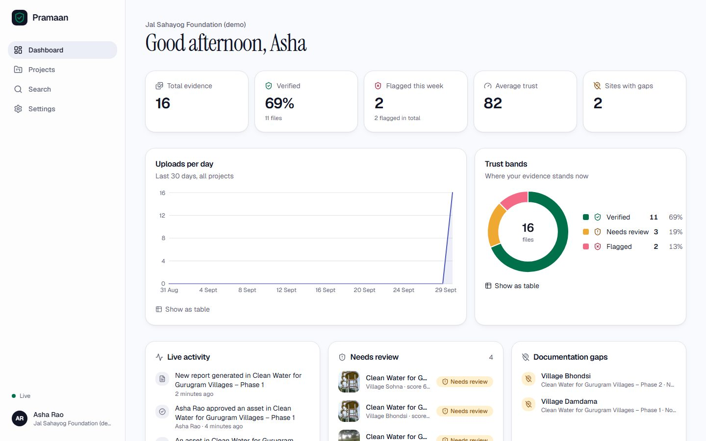
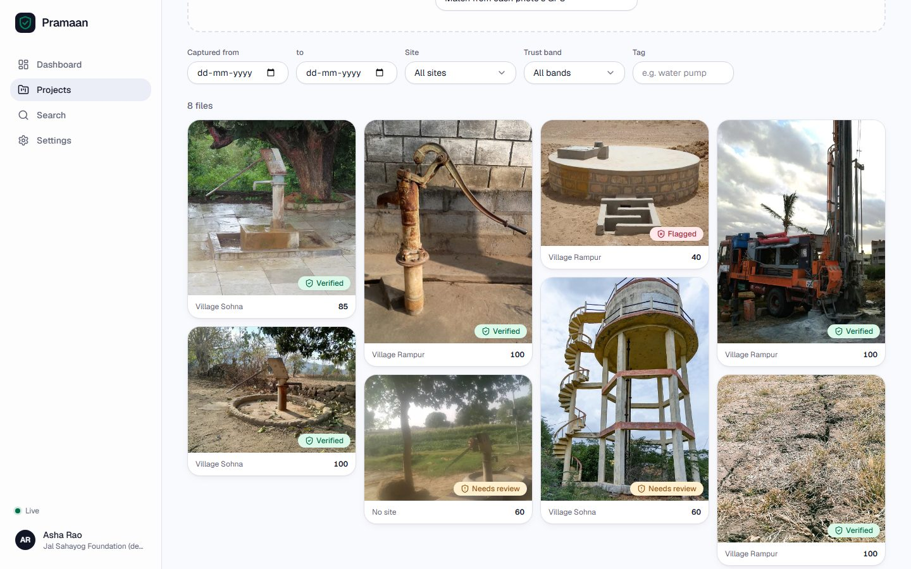
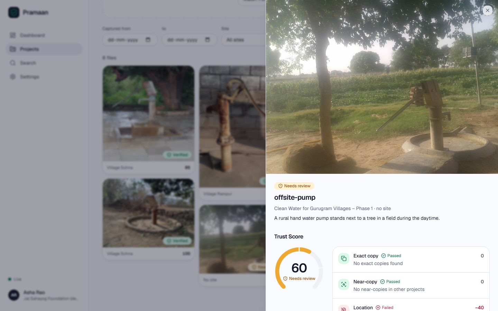
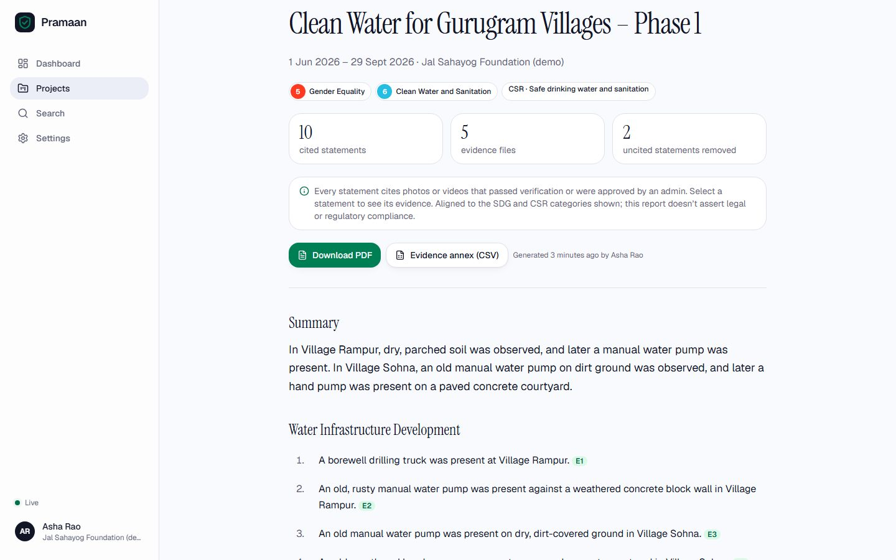
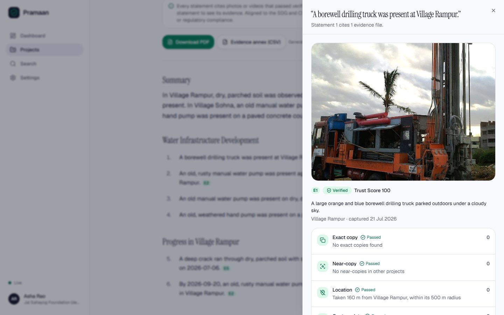
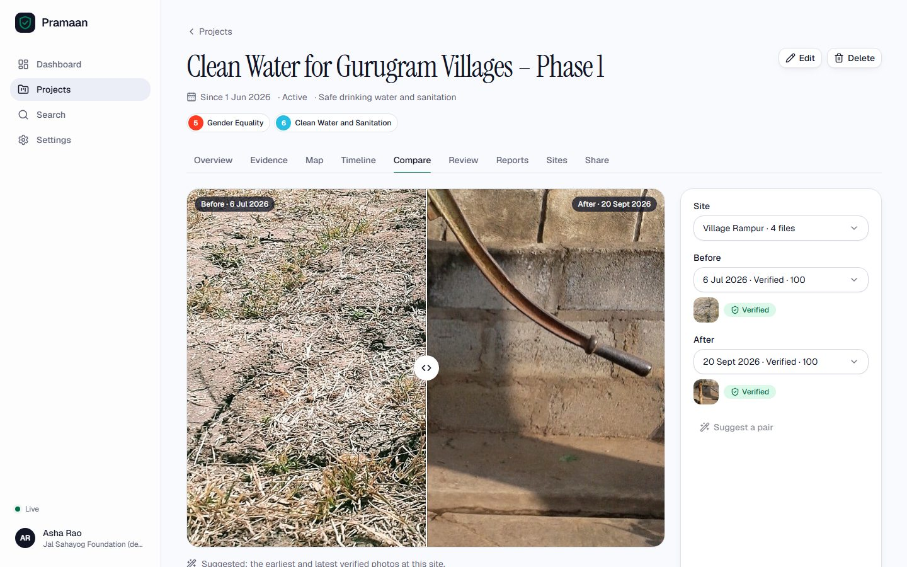
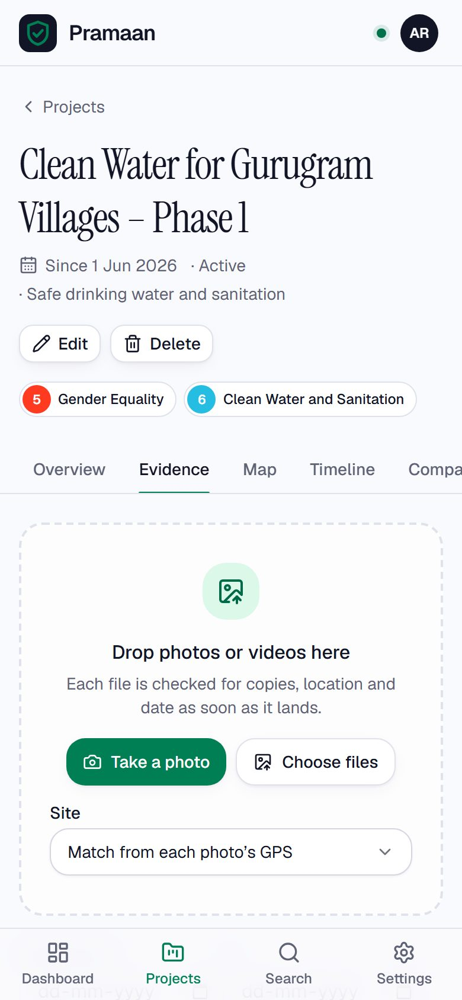
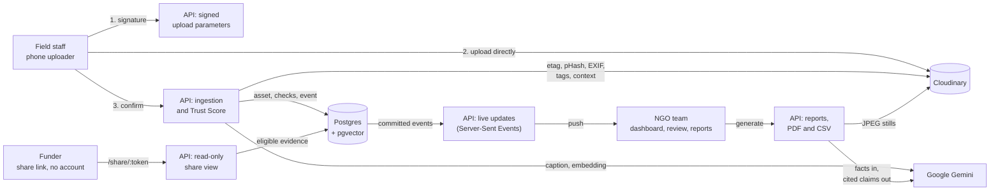
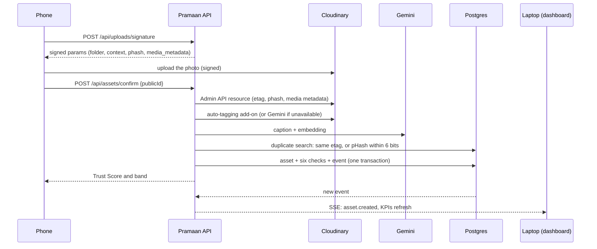
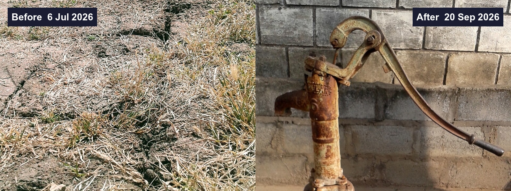

# Pramaan: proof, not promises

**Pramaan** (Hindi for "proof") is a verified impact-evidence platform for NGOs, CSR teams
and funders. Field staff upload photos and videos from the field. Pramaan checks every
file, gives it a transparent **Trust Score**, and writes funder reports in which **every
sentence links back to the photos that prove it**.

> We don't just organise evidence. We prove it's genuine, and every claim links back to a
> photo.



## The problem

NGOs are funded on evidence: photos of the borewell, the classroom, the solar roof. Funders
and CSR teams receive thousands of them and can't tell which are real.

- **The same photo is reused** across projects and funders, sometimes resized or cropped
  so it doesn't look identical.
- **Photos are taken somewhere else, or at another time.** A hand pump from another
  district, or last year's "after" photo.
- **Reports make claims nobody can trace**: "Three villages now have clean water",
  according to what?
- **Checking by hand doesn't scale.** A field team uploads dozens of photos a day.

## What Pramaan does

|                                   |                                                                                                                                                                                                                  |
| --------------------------------- | ---------------------------------------------------------------------------------------------------------------------------------------------------------------------------------------------------------------- |
| **Checks every upload**           | Six transparent checks: exact copies, near-copies, wrong place, wrong time, missing metadata and late uploads. Each one explains itself ("Taken 41.1 km from the nearest site, Village Rampur").                 |
| **Catches reuse across projects** | Cloudinary's etag finds byte-identical copies; its perceptual hash finds resized or re-compressed ones. A reused photo flags both copies.                                                                        |
| **Keeps people in the loop**      | Admins approve or reject flagged evidence with a required note. Decisions are an append-only audit trail and never change the score.                                                                             |
| **Stays live**                    | The dashboard, project pages and review queue update over Server-Sent Events as uploads land, with no refresh.                                                                                                   |
| **Finds evidence by meaning**     | Semantic search ("women collecting water") with Gemini embeddings and pgvector, plus a keyword fallback.                                                                                                         |
| **Shows change**                  | Before/after comparison per site, with a labelled side-by-side image built by Cloudinary.                                                                                                                        |
| **Warns about gaps**              | Sites without verified evidence for 30 days (configurable) are flagged live.                                                                                                                                     |
| **Writes cited reports**          | Gemini drafts a report from verified evidence only. Any sentence that doesn't cite eligible photos is dropped. Every statement opens its evidence; export as PDF (with thumbnails and an evidence annex) or CSV. |
| **Shares with funders**           | Expiring, revocable, read-only links. No sign-in, and nothing can be changed through them.                                                                                                                       |

<table>
  <tr>
    <td></td>
    <td></td>
  </tr>
  <tr>
    <td></td>
    <td></td>
  </tr>
  <tr>
    <td></td>
    <td></td>
  </tr>
</table>

_Screenshots come from the seeded demo organisation (see [Demo data](#demo-data)), running on
real Cloudinary and Gemini: captions, tags, thumbnails and the report text are theirs. A
4-minute walkthrough is in [docs/demo-script.md](docs/demo-script.md)._

## Architecture



The browser never sends anything Pramaan scores. It uploads to Cloudinary, then tells the
API which file it uploaded. The API re-fetches the file's etag, perceptual hash and EXIF
from Cloudinary itself, and scores from that.



**Stack:** pnpm workspaces · React 18, Vite, Tailwind, shadcn/ui (Radix), TanStack Query,
React Router, Recharts, Leaflet · Express 5, zod, Drizzle ORM, Postgres 17 + pgvector ·
Cloudinary Node SDK v2 · Google Gen AI SDK (Gemini) · @react-pdf/renderer, csv-stringify ·
Vitest, Supertest, Playwright · Docker, Render, Neon.

## How we use Cloudinary

Cloudinary is the evidence store and part of the verification engine. The code lives in
[`apps/api/src/services/media.ts`](apps/api/src/services/media.ts).

| Feature                     | How Pramaan uses it                                                                                                                                                                                                                                                                                                                                                                                                                                                                                                                                              |
| --------------------------- | ---------------------------------------------------------------------------------------------------------------------------------------------------------------------------------------------------------------------------------------------------------------------------------------------------------------------------------------------------------------------------------------------------------------------------------------------------------------------------------------------------------------------------------------------------------------- |
| **Signed uploads**          | `POST /api/uploads/signature` signs the upload parameters with `cloudinary.utils.api_sign_request`. The browser posts the file straight to `api.cloudinary.com/v1_1/<cloud>/auto/upload`, so the API secret never leaves the server and large videos never pass through our API. Each file goes to `pramaan/<org>/<project>`, using `asset_folder` plus `public_id_prefix` on dynamic-folder accounts (detected with `api.config({ settings: true })`) or `folder` on older ones. `allowed_formats` restricts uploads to the formats phones and cameras produce. |
| **Server-side re-fetch**    | On confirm, the API calls `api.resource(publicId, { phash: true, media_metadata: true })` and scores only what Cloudinary returns. Client-sent tags, hashes or EXIF are never trusted.                                                                                                                                                                                                                                                                                                                                                                           |
| **etag**                    | The MD5 of the file's bytes. The same etag anywhere else in the organisation is an **exact duplicate** (−60). Within one project, a 7-day burst window allows genuine re-uploads.                                                                                                                                                                                                                                                                                                                                                                                |
| **pHash**                   | Cloudinary's 64-bit perceptual hash is stored as `bit(64)`. **Near-duplicates** in other projects are found in SQL with `bit_count(phash # $1) <= threshold` (default 6/64), which catches resized, re-compressed or lightly cropped copies (−40).                                                                                                                                                                                                                                                                                                               |
| **Media metadata**          | `DateTimeOriginal` and GPS (decimal or `28 deg 28' 12.30" N`) come from Cloudinary's embedded metadata. They drive the wrong-location, wrong-time, missing-metadata and late-upload checks.                                                                                                                                                                                                                                                                                                                                                                      |
| **Auto-tagging**            | At confirm, `api.update(publicId, { categorization: 'google_tagging', auto_tagging: 0.6 })` runs the tagging add-on (Google, Imagga or AWS Rekognition, configurable). If the add-on isn't enabled or is out of quota, Pramaan falls back to Gemini vision automatically, pauses the add-on for an hour, and records which provider tagged each file.                                                                                                                                                                                                            |
| **Context metadata**        | Pramaan writes its verdict back: `pramaan_project_id`, `pramaan_site_id` and `pramaan_trust_score` as context on the asset. The Cloudinary Media Library then shows the Trust Score next to the file. Context is used instead of structured metadata because it works on every account without defining fields first.                                                                                                                                                                                                                                            |
| **Thumbnails**              | `c_fill,g_auto,w_480,h_<aspect>/f_auto,q_auto`: subject-aware crops in the photo's own shape (clamped between 3:4 and 4:3), in the best format each browser supports. Videos use an automatically chosen frame (`so_auto`).                                                                                                                                                                                                                                                                                                                                      |
| **Previews**                | `c_limit,w_1600/f_auto,q_auto` for the detail drawer, the compare slider and the report reader.                                                                                                                                                                                                                                                                                                                                                                                                                                                                  |
| **Before/after composites** | One URL builds a labelled side-by-side image on the CDN. The "before" photo is cropped to 800×600 (`g_auto`) and padded to 1600 wide. The "after" photo is overlaid on the right as a layer, positioned with `fl_layer_apply,g_east`. Text layers add "Before · date" and "After · date". The image can be downloaded or embedded, and no new file is stored.                                                                                                                                                                                                    |
| **PDF stills**              | Reports embed `c_fill,g_auto,w_480,h_360/q_auto` stills as explicit JPEGs, because the PDF renderer can't embed the WebP that `f_auto` might serve.                                                                                                                                                                                                                                                                                                                                                                                                              |

This before/after image is a single Cloudinary URL built from two uploads in the demo. It
wasn't stored anywhere; the CDN renders and caches it:



## Trust Score

Every file starts at 100 and loses points for each check it fails. The score is clamped to
0–100 and put into a band. Every number below is a default that admins can change on the
Settings page. Saving shows how many files would change band first, then re-scores
everything and updates open dashboards live.

| Check            | Fails when                                                                                                                             | Deduction |
| ---------------- | -------------------------------------------------------------------------------------------------------------------------------------- | --------- |
| Exact duplicate  | Same etag as a file in another project, or in the same project more than 7 days apart                                                  | −60       |
| Near duplicate   | pHash within 6 of 64 bits of a file in another project                                                                                 | −40       |
| Wrong location   | Farther from its site than the site's radius; −40 when beyond 10× the radius. Files not at any site are compared with the nearest one. | −25 / −40 |
| Wrong time       | Captured before the project started or after it ended                                                                                  | −20       |
| Missing metadata | No GPS or no capture date. This means "unverified", never "fake".                                                                      | −15       |
| Late upload      | Uploaded more than 90 days after it was captured                                                                                       | −10       |

| Band         | Score  |
| ------------ | ------ |
| Verified     | 80–100 |
| Needs review | 50–79  |
| Flagged      | 0–49   |

Reports cite only **eligible** evidence: verified files that no admin rejected, plus review
or flagged files an admin approved. Approval never changes the score: the original score
and the reviewer's note stay visible in the app and in the report annex.

## Run it locally

With Docker, three commands:

```sh
git clone https://github.com/amardeepgit8759/Pramaan-Verified-Impact-Evidence-Platform.git && cd Pramaan-Verified-Impact-Evidence-Platform
cp .env.example .env        # add your Cloudinary and Gemini keys, and a JWT_SECRET (see below)
docker compose up --build   # app on http://localhost:3000, Postgres + pgvector included
```

The API won't start without the required variables, and lists every missing one.
Migrations run automatically on start.

**Demo data.** With the app running, `pnpm install && SEED_BASE_URL=http://localhost:3000
pnpm seed:demo` creates a demo organisation through the real API and prints its sign-in.
See [demo-data/README.md](demo-data/README.md).

**For development** (Node 22, pnpm 10):

```sh
pnpm install
pnpm db:up     # Postgres + pgvector on :55432, and a throwaway test database on :55433
pnpm dev       # API on :8787 (tsx watch), web on http://localhost:5173 (Vite, proxies /api)
```

## Environment variables

All variables are validated with zod at startup, and [.env.example](.env.example) documents
each one.

| Variable                                                               | Required | Default                           | Purpose                                                                                                                             |
| ---------------------------------------------------------------------- | -------- | --------------------------------- | ----------------------------------------------------------------------------------------------------------------------------------- |
| `DATABASE_URL`                                                         | yes      |                                   | Postgres with pgvector. In production, Neon's direct string with `?sslmode=verify-full`                                             |
| `JWT_SECRET`                                                           | yes      |                                   | 32+ random characters for signing session cookies: `node -e "console.log(require('crypto').randomBytes(48).toString('base64url'))"` |
| `CLOUDINARY_CLOUD_NAME`, `CLOUDINARY_API_KEY`, `CLOUDINARY_API_SECRET` | yes      |                                   | Cloudinary Console → Settings → API Keys                                                                                            |
| `GEMINI_API_KEY`                                                       | yes      |                                   | Google AI Studio                                                                                                                    |
| `GEMINI_VISION_MODEL`, `GEMINI_REPORT_MODEL`, `GEMINI_EMBEDDING_MODEL` | yes      | see `.env.example`                | Model ids are configuration, never code                                                                                             |
| `GEMINI_VISION_FALLBACK_MODELS`, `GEMINI_REPORT_FALLBACK_MODELS`       |          | see `.env.example`                | Comma-separated models tried in order when the main model is still over capacity after retries                                      |
| `TAGGING_PROVIDER`                                                     |          | `cloudinary`                      | `cloudinary` (add-on first, Gemini fallback) or `gemini`                                                                            |
| `CLOUDINARY_TAGGING_ADDON`                                             |          | `google_tagging`                  | Or `imagga_tagging`, `aws_rek_tagging`                                                                                              |
| `CLOUDINARY_AUTO_TAGGING_MIN_CONFIDENCE`                               |          | `0.6`                             | Tags below this confidence are dropped                                                                                              |
| `CLOUDINARY_UPLOAD_FOLDER`                                             |          | `pramaan`                         | Root folder for uploads                                                                                                             |
| `SESSION_TTL_DAYS`                                                     |          | `7`                               | Session cookie lifetime                                                                                                             |
| `RATE_LIMIT_*`, `AUTH_RATE_LIMIT_*`                                    |          | 300/min, 20/15 min                | Global and sign-in limits                                                                                                           |
| `AI_RATE_LIMIT_*`, `REPORT_RATE_LIMIT_*`                               |          | 120/min per user, 10/hour per org | Gemini-backed endpoints                                                                                                             |
| `PUBLIC_URL`                                                           |          | `RENDER_EXTERNAL_URL` on Render   | Absolute URLs in social-preview metadata                                                                                            |
| `PORT`, `LOG_LEVEL`, `NODE_ENV`, `WEB_DIST_DIR`                        |          | `8787`, `info`, …                 | Set by the Docker image where needed                                                                                                |
| `TWILIO_*`                                                             |          |                                   | Optional; reserved for WhatsApp ingest                                                                                              |

## Deploy (Render + Neon)

The whole app ships as one Docker image: the API serves the built web app from the same
origin, so cookies and Server-Sent Events need no CORS.

1. Create a Neon project (AWS Singapore, next to the Render service) and copy its **direct**
   connection string, ending in `?sslmode=verify-full`. The first migration enables
   `pgvector`.
2. In Render, choose **New → Blueprint** and select this repository.
   [`render.yaml`](render.yaml) defines the service: Docker, Singapore, a health check on
   `/api/health`, and auto-deploy on push. Render asks for `DATABASE_URL`, the Cloudinary
   keys and the Gemini key, and generates `JWT_SECRET`.
3. Each deploy runs migrations on start. `/api/health` reports the database, pgvector and
   latency.

## Tests

| Command                          | What runs                                                                                                                                                                                                                                                                                                                  |
| -------------------------------- | -------------------------------------------------------------------------------------------------------------------------------------------------------------------------------------------------------------------------------------------------------------------------------------------------------------------------- |
| `pnpm lint` · `pnpm typecheck`   | ESLint and `tsc` across every package                                                                                                                                                                                                                                                                                      |
| `pnpm test` (after `pnpm db:up`) | **Shared** (200 tests): Trust Score, EXIF parsing, haversine, Hamming distance, the report-claim validator, all at 100% coverage. **API** (131): integration tests against real Postgres + pgvector, with Cloudinary and Gemini replaced by test doubles at the service boundary. **Web** (53): component and route tests. |
| `pnpm build && pnpm e2e`         | Playwright journeys against the production build. Upload → flagged → review → approved; live dashboard updates from a second browser; search, compare and gaps; report → PDF/CSV → funder share link. A local stand-in for Cloudinary reads real EXIF and computes real perceptual hashes.                                 |
| `BASE_URL=https://… pnpm e2e`    | The same journeys against a deployment, using real Cloudinary                                                                                                                                                                                                                                                              |
| `pnpm test:live`                 | Opt-in: a real signed upload to Cloudinary (etag, pHash, EXIF, tagging, context, composite), and real Gemini captioning, embeddings and report writing                                                                                                                                                                     |

**No mock data in the app.** Everything on screen comes from the database through the API.
Tests live outside the shipped source, so this finds nothing in code:

```sh
grep -rniE "mock|lorem|faker|dummy|fake" apps/web/src apps/api/src
```

The single match is the landing-page copy promising that missing metadata is called
"unverified, never 'fake'". (HTML input hints such as `placeholder="e.g. water pump"` are
form hints, not data.)

## Project layout

```text
apps/api         Express API: auth, ingestion, Trust Score, SSE, search, reports, sharing
apps/web         React app; also the public funder page
packages/shared  zod schemas, Trust Score maths, EXIF parsing, report validation
scripts          Demo data preparation and the demo seed
demo-data        Freely licensed demo photos and what each one demonstrates
docs             Screenshots and the demo script
```

More detail: [DECISIONS.md](DECISIONS.md) explains why things are the way they are,
[PROGRESS.md](PROGRESS.md) holds the phase-by-phase build log, and
[docs/demo-script.md](docs/demo-script.md) is a 4-minute walkthrough.

## Demo data

[demo-data/](demo-data/) holds 14 freely licensed photos from Wikimedia Commons, plus one
derived near-duplicate. `pnpm seed:demo` uploads them through the real pipeline for a demo
organisation with three projects. It plants an exact duplicate across projects, a resized
near-duplicate, an off-site photo, a photo without EXIF and two documentation gaps, then
reviews one photo and generates a report. It never inserts scores or metrics directly.

## Credits

### APIs and services

- [Cloudinary](https://cloudinary.com): storage, signed uploads, Admin API (etag, pHash,
  media metadata), auto-tagging add-ons, context metadata and transformations.
- [Google Gemini](https://ai.google.dev): captions (`gemini-3.5-flash`), embeddings
  (`gemini-embedding-2`, 768 dimensions) and report drafting (`gemini-3.8-flash`).
- [OpenStreetMap](https://www.openstreetmap.org/copyright) map tiles, © OpenStreetMap
  contributors (ODbL), shown with [Leaflet](https://leafletjs.com).
- [Neon](https://neon.tech) (Postgres + pgvector) and [Render](https://render.com)
  (hosting).
- Demo photos from [Wikimedia Commons](https://commons.wikimedia.org); authors and
  licences are listed in [demo-data/README.md](demo-data/README.md).
- UN Sustainable Development Goal names and colours from the
  [UN SDG communication materials](https://www.un.org/sustainabledevelopment/news/communications-material/).
- Fonts: [Geist](https://github.com/vercel/geist-font) and
  [Instrument Serif](https://github.com/Instrument/instrument-serif), both under the SIL
  Open Font License (copies in `apps/web/public/fonts`).

### Libraries

The licence is MIT unless stated.

| Area              | Libraries                                                                                                                                                                                                                                                                                   |
| ----------------- | ------------------------------------------------------------------------------------------------------------------------------------------------------------------------------------------------------------------------------------------------------------------------------------------- |
| Web app           | React, React DOM, React Router, TanStack Query, Radix UI (`radix-ui`), Tailwind CSS, tw-animate-css, class-variance-authority (Apache-2.0), clsx, tailwind-merge, Lucide icons (ISC), Recharts, Leaflet (BSD-2-Clause), React Leaflet (Hippocratic License 2.1), Framer Motion, Sonner, zod |
| API               | Express, helmet, express-rate-limit, compression, cookie-parser, jsonwebtoken, pino, pino-http, Cloudinary Node SDK, Google Gen AI SDK (Apache-2.0), Drizzle ORM (Apache-2.0), node-postgres (`pg`), @react-pdf/renderer, csv-stringify                                                     |
| Build and tooling | TypeScript (Apache-2.0), Vite, @vitejs/plugin-react, @tailwindcss/vite, tsup, tsx, drizzle-kit, ESLint, typescript-eslint, eslint-plugin-react-hooks, eslint-plugin-react-refresh, Prettier, pino-pretty                                                                                    |
| Testing           | Vitest, @vitest/coverage-v8, Testing Library (DOM, React, jest-dom, user-event), jsdom, Supertest, Playwright (Apache-2.0), PDF.js (`pdfjs-dist`, Apache-2.0), csv-parse, multer, jpeg-js (BSD-3-Clause), piexifjs                                                                          |
| Data              | Postgres, [pgvector](https://github.com/pgvector/pgvector) (PostgreSQL License), `pgvector/pgvector` Docker image                                                                                                                                                                           |

Thank you to every maintainer above.
